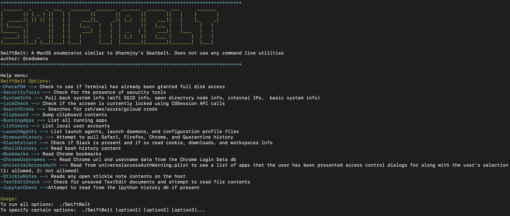

# SwiftBelt

## About

SwiftBelt is a macOS enumerator inspired by @harmjoy's Windows-based Seatbelt enumeration tool. SwiftBelt does not utilize any command line utilities and instead uses Swift code (leveraging the Cocoa Framework, Foundation libraries, OSAKit libraries, etc.) to perform system enumeration. This can be leveraged on the offensive side to perform enumeration once you gain access to a macOS host. I intentionally did not include any functions that cause pop-ups (ex: keychain enumeration).

Thanks Ramos04 for contributing code to look for various Objective See tools and mattreduce for contributing code for zshell history as well as azure creds.

-----------------------

## Steps
1. Ensure swift is installed on your macOS host 

2. From a terminal cd into the SwiftBelt directory and run: "swift build" to generate the binary. The binary will be dropped in the .build/debug folder inside of the SwiftBelt folder and will be named SwiftBelt

3. Copy to the desired host and clear the quarantine attribute ($ xattr -c SwiftBelt) and set as executable ($ chmod +x SwiftBelt)

4. Execute 

## Help menu:

***SwiftBelt Options:***

**-CheckFDA** --> Check for Full Disk Access (without generating a TCC prompt to the user even if Terminal has not been granted any TCC permissions). Does this searching for TCC.db using Spotlight db API queries. Will return wither FDA has already been granted to your app context or not.

**-SecurityTools** --> Check for the presence of common macOS security tools (at least the ones I am familiar with)

**-SystemInfo** --> Check for the current execution context, TCC Accessibility access, basic system info, last boot time, idle time, info on whether the screen is currently locked or not, and environment variable info

**-LockCheck** --> Check for whether the screen is currently locked or not (I added this as a separate check as well as bundled it within SystemInfo)

**-SearchCreds** --> Search for ssh/aws/azure/gcloud creds

**-Clipboard** --> Dump clipboard contents

**-RunningApps** --> List all running apps

**-ListUsers** --> List local user accounts

**-LaunchAgents** --> List launch agents, launch daemons, and configuration profile files

**-BrowserHistory** --> Attempt to pull Safari, Firefox, Chrome, and Quarantine history (note as FYI: if Chrome or Firefox is actively running, the tool will not be able to read the locked database to extract info). However, the locked db can be copied elsewhere and read from.

**-SlackExtract** --> Check if Slack is present and if so read cookie, downloads, and workspaces info (leverages research done by Cody Thomas)

**-ShellHistory** --> Read shell (Bash or Zsh) history content

**-Bookmarks** --> Read Chrome saved bookmarks

**-ChromeUsernames** --> Read from ~/Library/Application Support/Google/Chrome/Default/Login Data which stores urls along with usernames for each

**-UniversalAccessAuth** --> Reads from /Library/Preferences/com.apple.universalaccessAuthWarning.plist to show a list of applications that the user has received authorization prompts for along with 1 (for accept) or 2 (for deny)

**-StickieNotes** --> Reads the contents of any open Stickie Note files on the system

**-TextEditCheck** --> Checks for unsaved TextEdit documents and attempts to read file contents

**-JupyterCheck** --> Checks for the presence of the ipython history db (which Jupyter notebook uses) and if found reads the contents (which includes python commands executed)

## Usage:

To run all options:  

> ./SwiftBelt

To specify certain options:  

> ./SwiftBelt [option1] [option2] [option3]...

Example:  

> ./SwiftBelt -SystemInfo -Clipboard -SecurityTools ...

-----------------------

## Detection

Though this tool does not use any command line utilities (which are easy to detect), this tool does read from several files on the system which can be detected by any tools that leverage the Endpoint Security Framework (these file reads in particular are captured by ES_EVENT_TYPE_NOTIFY_OPEN events within ESF).
